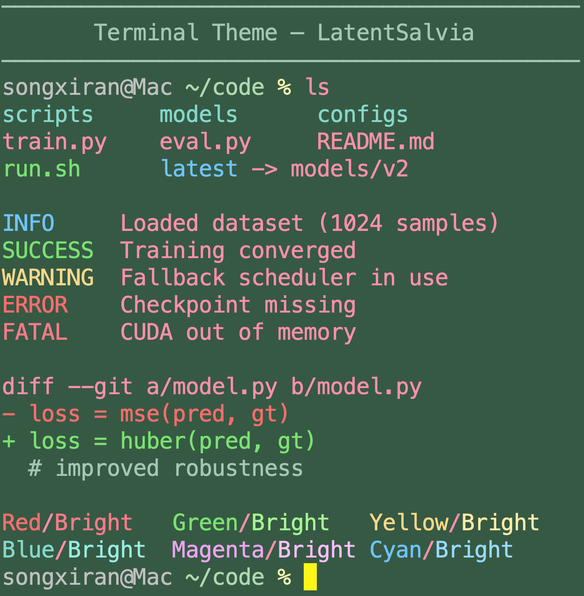

# LatentSalvia

**LatentSalvia** is a _calm_, _cute_, and _confident_ terminal theme designed for long research and development sessions, optimized and tested on **macOS Terminal.app**.

---

## Preview

<p align="center">
  
</p>

> Screenshot captured from Terminal.app, showing the output of `ansi_showcase.sh`.

---

## Repository Contents

```

.
├── LatentSalvia-base-v1.terminal      # Terminal.app profile
├── ansi_showcase.sh                   # ANSI showcase script
├── LatentSalvia-base-v1-showcase.png  # Screenshot of the ansi_showcase.sh output
├── README.md
└── LICENSE

````

---

## Installation (macOS Terminal.app)

1. Open **Terminal → Settings → Profiles**
2. Click the circle icon at the bottom left → **Import…**
3. Select `LatentSalvia-base-v1.terminal`
4. (Optional) Set it as the default profile


### Prompt Color Style (Important)

LatentSalvia uses an explicitly colored prompt.

Add the following to your `~/.zshrc`:

```zsh
# Prompt color separation (Menlo-friendly, soft theme)
PROMPT='%F{245}%n@%m%f %F{108}%~%f %F{229}%%%f '

# Enable colorized ls on macOS
alias ls='ls -G'
````

This results in:

* **Username / host** → muted gray
* **Working directory** → sage green
* **Prompt symbol (`%`)** → warm yellow

Apply changes with:

```zsh
source ~/.zshrc
```

---

## Base Colors

| Role       | HEX       |
| ---------- | --------- |
| Text       | `#FF90AA` |
| Background | `#3E5846` |
| Cursor     | `#FFF656` |

---

## ANSI Color Palette

### Normal ANSI Colors (0–7)

| ANSI | Name    | Semantic Role           | HEX       |
| ---: | ------- | ----------------------- | --------- |
|    0 | Black   | Background / separators | `#2C3E34` |
|    1 | Red     | Errors                  | `#9E202D` |
|    2 | Green   | Success / executables   | `#68B255` |
|    3 | Yellow  | Warnings                | `#D4BA76` |
|    4 | Blue    | Directories / structure | `#54A89C` |
|    5 | Magenta | Accents                 | `#A66FB1` |
|    6 | Cyan    | Info / symlinks         | `#4487B6` |
|    7 | White   | Default foreground      | `#F1EDEA` |

---

### Bright ANSI Colors (8–15)

| ANSI | Name           | Semantic Role       | HEX       |
| ---: | -------------- | ------------------- | --------- |
|    8 | Bright Black   | Comments / dim text | `#6F8F7E` |
|    9 | Bright Red     | Fatal errors        | `#E34A5A` |
|   10 | Bright Green   | Strong success      | `#8EE07A` |
|   11 | Bright Yellow  | Highlights          | `#F2DE9A` |
|   12 | Bright Blue    | Focus / emphasis    | `#7AD0C4` |
|   13 | Bright Magenta | Strong accents      | `#D89BE6` |
|   14 | Bright Cyan    | Notices / info      | `#6FB3E8` |
|   15 | Bright White   | Maximum contrast    | `#FFFFFF` |

---

## ANSI Showcase Script

To verify the theme on your Mac:

```zsh
zsh ansi_showcase.sh
```

The showcase is intentionally designed to:

* demonstrate realistic scenarios (`ls`, logs, git diff)
* show both **normal** and **bright** ANSI colors
* serve as a visual regression test after any changes

---

## License

See [LICENSE](LICENSE).
